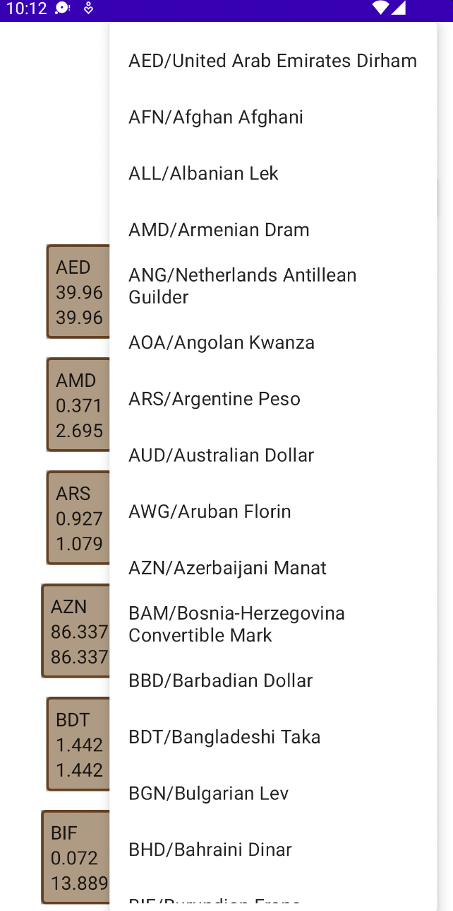

#### Currency Converter

## Stack of technologies:
- Kotlin coroutines
- Jetpack Compose
- Retrofit
- Dagger 2
- MockK

## Description:
Simple currency converter application, which uses free version of *openexchangerates.org* API.
Implemented features:
- Fetching currencies
- Fetching and computing rates for available currencies
- Caching of fetched data
- Conversion from any available currency to other one

## To do:
- Implement validation of input, to provide the ability to input any data without a crash
- Implement local caching using Room database to provide more control over the cache
- Make UI much fancier 